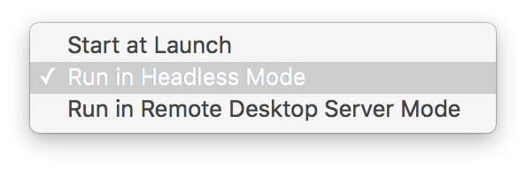

# vbox-osx-menubar

This is a clone of the [statusmenus][0] project hosted on SourceForge.

It has only a couple of patches (see commits) to remove the shadows and switch
to light icons for the dark menubar in OSX 10.10.

You can configure VMs to run in headless mode from the sub-menu:

[0]: https://sourceforge.net/projects/statusmenus/
